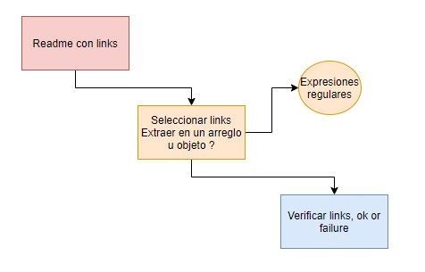
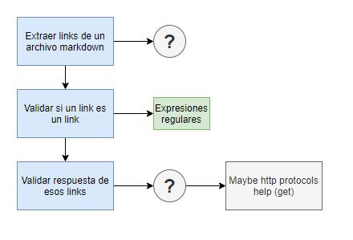
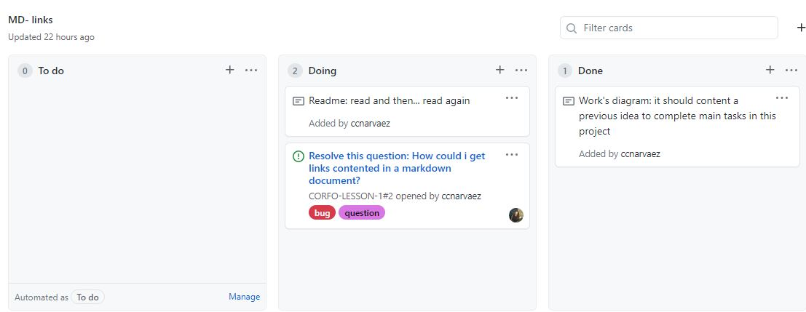

# Markdown Links

## Índice

* [1. Esquema inicial](#1-Esquema-inicial)
* [2. Planificación](#2-Planificación)

***

## 1. Esquema inicial
Iniciar un proyecto sin interfaz, una vez que te has acostumbrado al refuerzo visual, puede ser todo un reto.
Para superar este problema, una vez leído el archivo de instrucciones, se efectuó un esquema inicial con una secuencia de pasos, que aunque no fuera el más acertado, sirvió de guía inicial para empezar a realizar una investigación en forma sustentada.

Encontrar la manera de identificar cuando un "link es un link" fue fundamental para el desarrollo de una estructura de pasos más definida , y de ahí surgió el esquema de desarrollo con el que se orientó la investigación.

## 2. Planificación
Mantener una secuencia que determine el curso de los esfuerzos, es una excelente manera de mantener las actividades alineadas con los objetivos.
Hasta entonces, la planificación de los objetivos había sido llevada a cabo mediante la herramienta trello, pero en esta oportunidad, se llevó a cabo creando un project board en github.

(https://developer.mozilla.org/es/docs/Learn/JavaScript/Building_blocks/conditionals)
(https://developer.mozilla.org/es/docs/Learn/JavaScript/Building_blocks/Functions)
(https://developer.mozilla.org/es/docs/Web/JavaScript/Reference/Global_Objects/Array/)
(https://developer.mozilla.org/en-US/docs/Web/JavaScript/Reference/Statements/import)
(https://developer.mozilla.org/en-US/docs/Web/JavaScript/Reference/Statements/export))
(https://developer.mozilla.org/es/docs/Glossary/Callback_function)
(https://scotch.io/tutorials/javascript-promises-for-dummies#toc-consuming-promises)
(https://www.freecodecamp.org/news/how-to-write-a-javascript-promise-4ed8d44292b8/)

